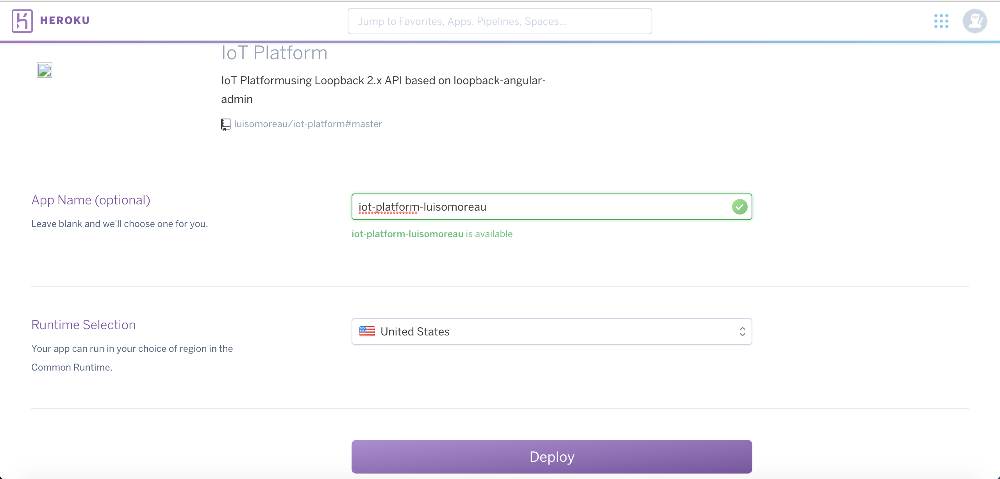
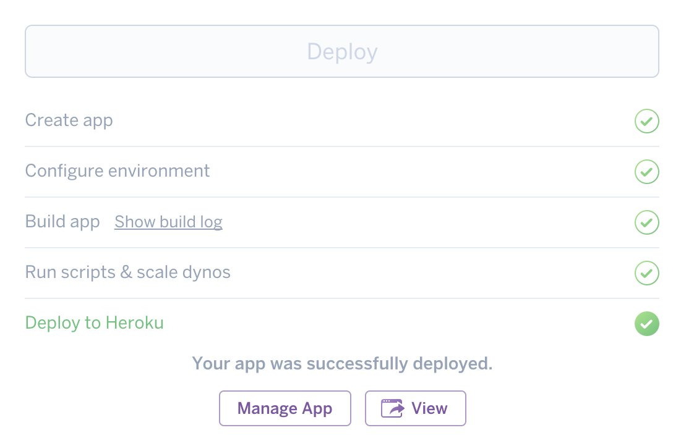
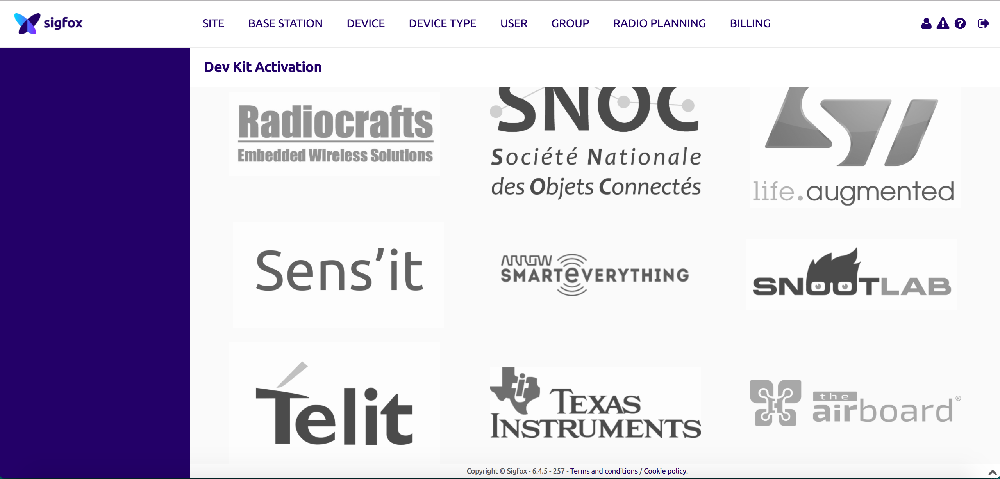
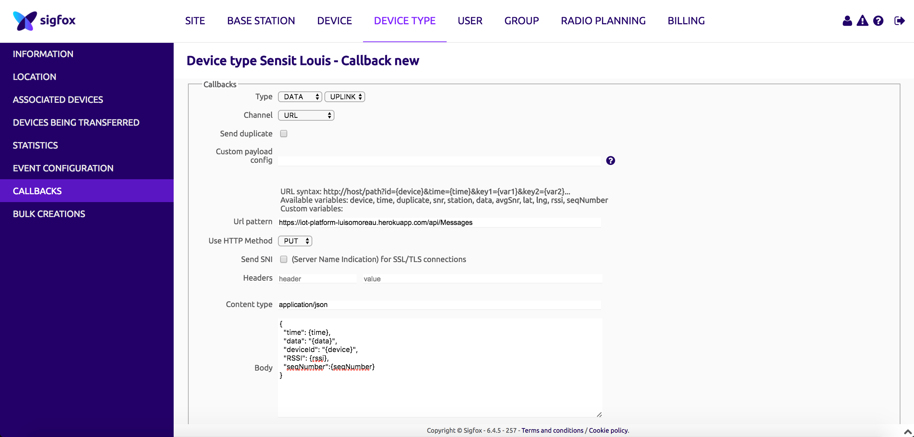
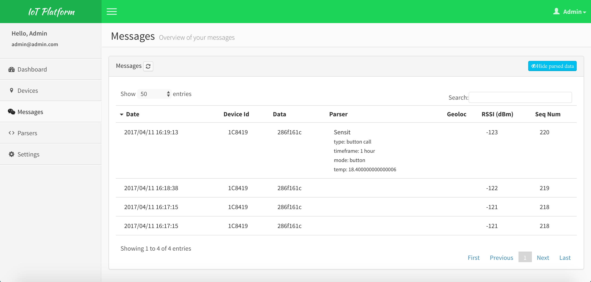

# IoT Platform

Angular + Loopback admin app to see Sigfox devices and messages.

I used [https://github.com/beeman/loopback-angular-admin](https://github.com/beeman/loopback-angular-admin) as a base project.
This project does not longer exists and has been replaced with [https://github.com/colmena/colmena-cms](https://github.com/colmena/colmena-cms).
Thank you [Bram Borggreve](https://github.com/beeman) for the base of the project!

## User guide

### Try it now with Heroku

Deploy an instance on your Heroku account to play around with it!

[](https://heroku.com/deploy)

An alternative way to get it running at Heroku is to install the [Heroku Toolbelt](https://toolbelt.heroku.com) and follow these steps:

```
git clone https://github.com/luisomoreau/iot-platform.git my-project
cd my-project
heroku apps:create my-project
git push heroku master
```

If you are not familiar with Heroku, just create an account an follow the procedure:

- Create a new app:



- Build app:


- App deployed:



- Open app and login:


### Users

After an installation the following users are created by the server/boot/02-load-users.js script:

- **Admin user**: Email: ```admin@admin.com```, password: ```admin```
- **Regular user**: Email: ```user@user.com```:, password ```user```

Please note, at this moment there is no difference in permissions for admin users or regular users. Feel free to submit a pull request!

### Usage

Now that you logged in, you should see the following dashboard:


If you click on the devices view, you will see that for the moment, no device are present:


- Activate your device in Sigfox Backend:

If you are using a Sigfox dev kit, you need to activate it first in Sigfox Backend:
To activate your dev kit, go to [https://backend.sigfox.com/activate](https://backend.sigfox.com/activate) and choose your provider.
Depending on your location, pick your country and then fill the device's ID, the PAC number and your details.
Both ID and PAC number are written on your dev kit or your box.
Check your emails and log in. Your device will appear in your account.
Click on its ID and go to messages to check if you received anything.
For example, I will use a Sens'it:




- Configure a callback:

Go to Device Type and and select your device type:


Click on Callbacks


Click on the small "New" button on the upper right corner:


Fill the information as shown in the picture below:



Add the URL from your Heroku application:

```
https://<your-app-name>.herokuapp.com/api/Messages
```

Replace the method by a "PUT" method and change the content type du "application/json"

Add the following JSON in the body:
```
{
  "time": {time},
  "data": "{data}",
  "deviceId": "{device}",
  "RSSI": {rssi},
  "seqNumber":{seqNumber}
}
```

Validate the custom callback.

You should see the following information in the callback view:


Now click on Device on the top menu and select your device.
Click on the message tab:


Send a message with your device (here a sensit, double click on the button for example):


Go back to your application and on the dashboard, you should see:


You will see that your device has been created automatically.


Now we will edit the device to associate the Sensit parser. Click on the small pen under the action column:


Save your change:


You now can see your parsed messages:



### Add Sigfox Geolocalisation service:

If you wish to see the Sigfox Geolocation, go back back to Sigfox backend. You will need to create a new callback as the following:


The URL pattern is like:
```
http://<your-app-name>.herokuapp.com/api/Messages/update?where[time]={time}&where[deviceId]={device}
```

Select a "POST" HTTP method and the body:

```
{
"spotit":{
  "lat": {lat},
  "long":{lng},
  "precision": {radius}
  }
}
```

Then a second callback will update your message and the results will be like this if a result is available:


## Getting started

### Dependencies

Installation depends on `node`/`npm` with `grunt` and `bower` installed globally.

    $ npm install -g bower grunt-cli

### Installation:

One line installation:

    git clone https://github.com/luisomoreau/iot-platform.git && cd iot-platform && npm install && grunt build && grunt serve

Or follow this steps

Checkout the project:

    git clone https://github.com/luisomoreau/iot-platform.git

Install the Node packages:

    npm install

Run grunt build:

    grunt build

Run grunt serve to start the API and frontend:

    grunt serve


## Running

The project is separated in a server and a client.

### Server

To run the server you issue the command:

    npm start

Or to run it with nodemon (needs `nodemon` installed globally). This will
automatically restart the server when you change its code:

    npm run dev

The command `grunt serve` explained below wil automatically start the API.

### Client

Rebuild the lb-services.js file with the correct `API_URL` for development.

    API_URL=http://0.0.0.0:3000/api grunt

To run the client you issue the command. This will also start the API.

    grunt serve

It will open the project in your default browser with livereload enabled.
This will take care of reloading the page when you change your code.


## Deploy using Dokku

If you don't know Dokku, it is a small PaaS implementation. It let you to build and manage the lifecyle of your applications.
It works almost the same way as Heroku but you can host it on your own servers.

Below is how to install it with debian system, you can still visit [http://dokku.viewdocs.io/dokku/](http://dokku.viewdocs.io/dokku/)
to get started with other systems.

```
wget https://raw.githubusercontent.com/dokku/dokku/v0.8.2/bootstrap.sh;
sudo DOKKU_TAG=v0.8.2 bash bootstrap.sh

```
Once the installation is complete, you can open a browser to setup your SSH key and virtualhost settings.
Open your browser of choice and navigate to the host's IP address -
or the domain you assigned to that IP previously - and configure Dokku via the web admin.
Visit [https://www.digitalocean.com/community/tutorials/how-to-use-the-digitalocean-dokku-application](https://www.digitalocean.com/community/tutorials/how-to-use-the-digitalocean-dokku-application)
for more info.

Once Dokku is installed, we will deploy the app, add a Mongo Database and set the Environment variables:

- Deploy the app:

From your local repository:

```
 git remote add <production> dokku@<your-domain>:<your-app-name>
 git push <production> master

```

- Create a Mongo service:

Enter in your server (via SSH) and install dokku-mongo plugin:
```
sudo dokku plugin:install https://github.com/dokku/dokku-mongo.git mongo
```
Create your mongo service:
```
dokku mongo:create <productionDB>
dokku mongo:expose <productionDB>
dokku mongo:info <productionDB>
```
You should get a result looking like:
```
Container Information
       Config dir:          /var/lib/dokku/services/mongo/iot-platform/config
       Data dir:            /var/lib/dokku/services/mongo/iot-platform/data
       Dsn:                 mongodb://<productionDB>:<TOKEN>@dokku-mongo-<productionDB>:27017/<productionDB>
       Exposed ports:       27017->19960 27018->2848 27019->1609 28017->23749
       Id:                  <ID>
       Internal ip:         172.17.0.5               
       Links:               -                        
       Service root:        /var/lib/dokku/services/mongo/<productionDB>
       Status:              running                  
       Version:             mongo:3.2.9    
```

Visit [https://github.com/dokku/dokku-mongo](https://github.com/dokku/dokku-mongo) for more info.


- Set the environment variables:

On your remote server:
```
dokku config:set <your-app-name> MONGO_URL="mongodb://<productionDB>:<TOKEN>@<your-domain>:19960/<your-app-name>"
```
You can do the same with your "GOOGLE_KEY".

- Use Letsencrypt to automatically install TLS certificates for HTTPS:


```
# dokku 0.5+
$ sudo dokku plugin:install https://github.com/dokku/dokku-letsencrypt.git

dokku config:set --no-restart myapp DOKKU_LETSENCRYPT_EMAIL=<your@email.tld>
dokku letsencrypt <your-app-name>

```
Dokku's default nginx template will automatically redirect HTTP requests to HTTPS when a certificate is present.
Visit [https://github.com/dokku/dokku-letsencrypt](https://github.com/dokku/dokku-letsencrypt) for more info.
